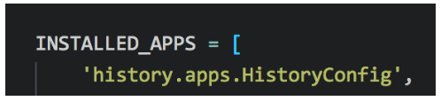
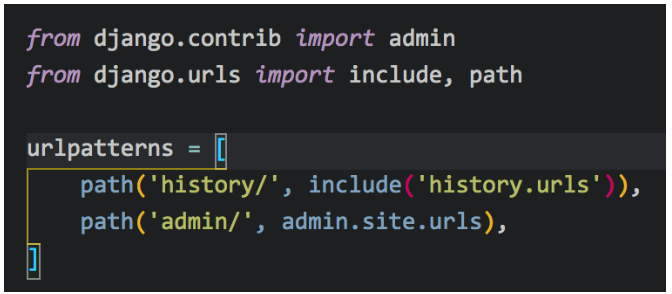
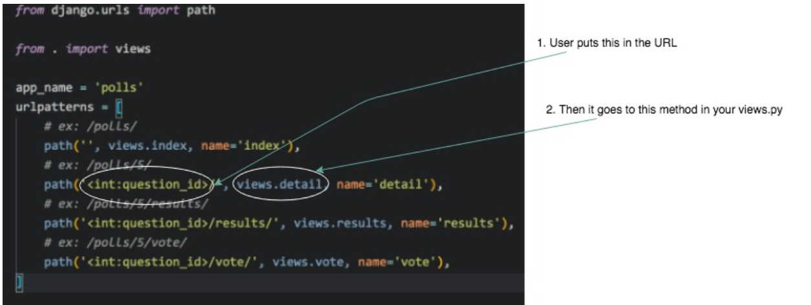
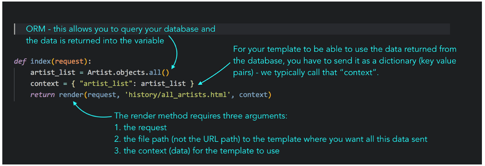

# Steps to set up a new Django web app

1. `mkdir projectname`
1. `cd` into project
1. Initialize your virtual environment
`virtualenv env`
1. Activate virtual environment `source env/bin/activate`
(To end your virtual environment: `deactivate`)
1. Install Django
`pip install django`
1. Create a new project
`django-admin startproject [nameofyourproject]`
1. `cd` into your project
1. Create an app within the project
`python manage.py startapp [nameofyourapp]`
1. In `settings.py`, add your app name to the “included apps” section (see below)
1. Run initial migration `python manage.py migrate`
1. Create your models
1. Run makemigrations
`python manage.py makemigrations [nameofyourapp]`
1. Run migrate
`python manage.py migrate`
1. Check your DB Browser - your tables should be there now! (You’ll be opening the `db.sqlite` file in DB Browser)
1. Create a `urls.py` file in your app and add necessary urls
1. In your project `urls.py`, add your app as a URL path (see below)
1. Now you’re ready to start writing views, templates, and URL paths in your app! See the signal flow below.

`settings.py`

Project `urls.py`

Signal Flow

The many parts of a view

