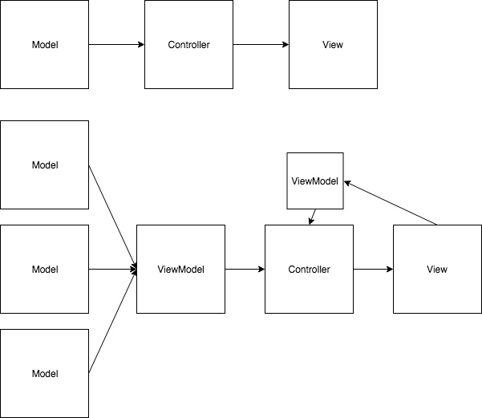

# ViewModels

If you find that you need data from multiple models to appear on the view, that means it's time for a ViewModel. 

If you are displaying data from only one model, you can go the traditional route (model -> controller -> view)

A ViewModel allows you to bring together multiple models that can then be displayed on the same view.

Take a look at the [course material](https://github.com/nashville-software-school/bangazon-inc/blob/master/book-3-workforce/chapters/VIEWMODELS.md) if you'd like to see code examples of ViewModels in action!